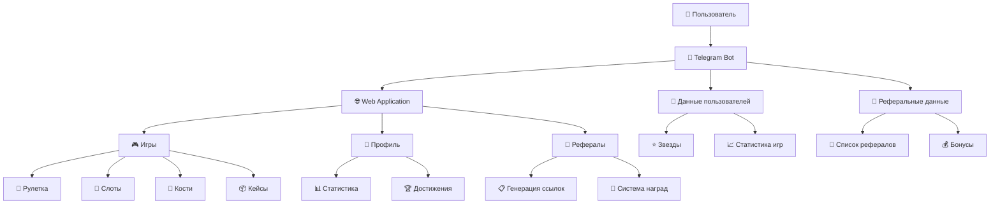
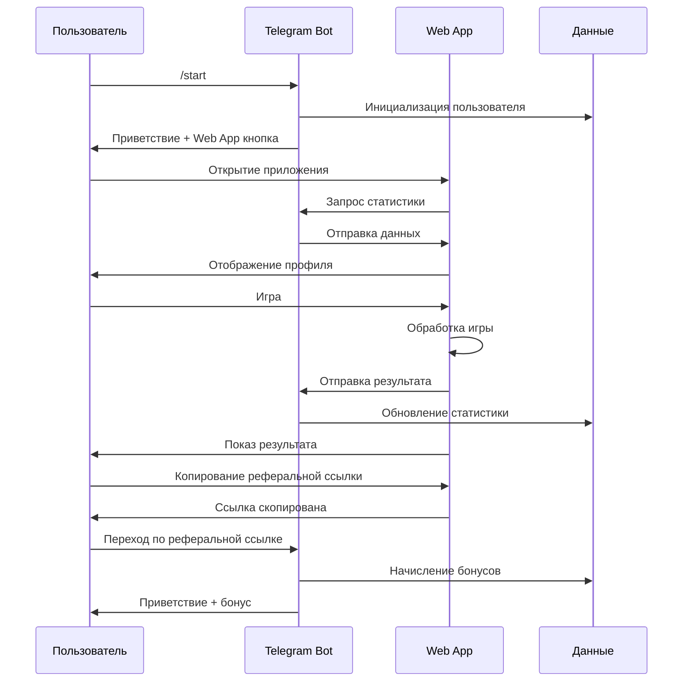

# 🏗️ Архитектура Telegram Casino Bot

## Схема системы



## Компоненты системы

### 🤖 Telegram Bot (`bot-example.py`)
- **Функции:**
  - Обработка команд пользователей
  - Управление реферальной системой
  - Хранение данных пользователей
  - Интеграция с Web App

- **Команды:**
  - `/start` - Инициализация пользователя
  - `/profile` - Показ профиля
  - `/balance` - Показ баланса
  - `/referral` - Реферальная программа
  - `/buy` - Покупка звезд
  - `/help` - Справка

### 🌐 Web Application
- **HTML (`index.html`):**
  - Структура интерфейса
  - Навигация между играми
  - Секция профиля
  - Реферальная система

- **CSS (`styles.css`):**
  - Адаптивный дизайн
  - Анимации и эффекты
  - Стили для профиля
  - Мобильная оптимизация

- **JavaScript (`script.js`):**
  - Логика игр
  - Управление статистикой
  - Интеграция с Telegram API
  - Обработка рефералов

### 🎮 Игровая система
- **Рулетка:** Ставки на цвета с множителями
- **Слоты:** Трехбарабанные автоматы
- **Кости:** Ставки на суммы кубиков
- **Кейсы:** Открытие призовых коробок

### 👤 Система профилей
- **Статистика:**
  - Количество игр
  - Процент побед
  - Общие выигрыши/проигрыши
  - Количество рефералов

- **Достижения:**
  - Первая игра
  - Первая победа
  - Азартный игрок (10 игр)
  - Дружелюбный (1 реферал)

### 🔗 Реферальная система
- **Генерация ссылок:** `https://t.me/bot?start=ref_USER_ID`
- **Бонусы:**
  - +25 ⭐ для реферала
  - +50 ⭐ для реферера
- **Отслеживание:** Статистика приглашений

## Поток данных



## Хранение данных

### В памяти (текущая реализация)
```python
user_data = {
    user_id: {
        'stars': int,
        'games_played': int,
        'games_won': int,
        'total_won': int,
        'total_lost': int,
        'referrals': int,
        'achievements': list
    }
}

referral_data = {
    referrer_id: [referred_user_ids]
}
```

### Рекомендации для продакшена
- **PostgreSQL** - для реляционных данных
- **Redis** - для кэширования и сессий
- **MongoDB** - для документной структуры
- **Backup** - регулярное резервное копирование

## Безопасность

### Текущие меры
- Валидация входных данных
- Проверка реферальных ссылок
- Ограничение на саморефералы

### Рекомендации для продакшена
- Серверная валидация игр
- Rate limiting
- Антифрод системы
- Шифрование данных
- HTTPS для всех соединений

## Масштабирование

### Горизонтальное масштабирование
- Микросервисная архитектура
- Load balancer
- Кэширование (Redis)
- CDN для статических файлов

### Вертикальное масштабирование
- Оптимизация запросов к БД
- Индексы для частых запросов
- Мониторинг производительности
- Автоматическое масштабирование

## Мониторинг

### Метрики
- Количество активных пользователей
- Конверсия рефералов
- Популярность игр
- Средний чек покупок

### Логирование
- Игровые события
- Ошибки приложения
- Пользовательские действия
- Производительность системы
